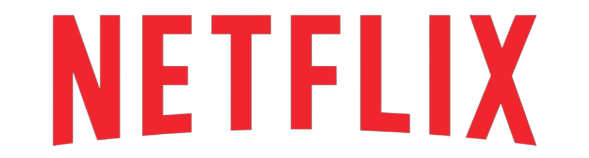

  

<h3> :dart: Objetivos do site</h3>
Site que consiste em ser um clone da famosa Netflix.

# <h3> :pencil: Tela de inicio</h3> 

# <h3> :pencil: Listas</h3>  

# <h3> :file_folder: Acessar o projeto</h3>
Acesse o projeto por meio deste [link](https://replicaofnetflix.netlify.app/).

# <h3> :x: Erros possíveis </h3>
O navegador pode acusar que o site é um site fraudulento, mas fique tranquilo, ele só acusa isso por causa que o site é um réplica do site da Netflix.

# <h3> :heavy_check_mark: Status do Projeto:</h3>

# <h3> :notebook_with_decorative_cover: Tecnologia usadas:</h3>

*  
*  
*  
* 

# <h3> :computer: Desenvolvedores:</h3>
[ Vinícius Boschi](https://github.com/Vinicius-Boschi)

# <h3> :bangbang: Licença:</h3>

 Todos os direitos reservados :copyright: 2022 - <strong>Clone da Netflix</strong>

